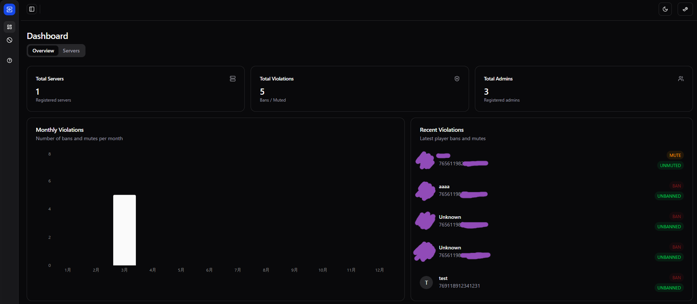
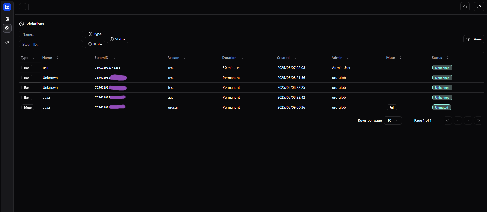
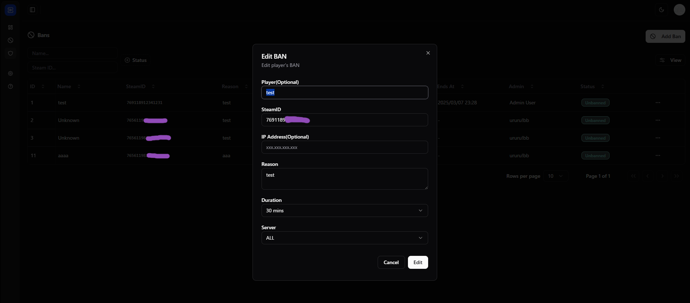
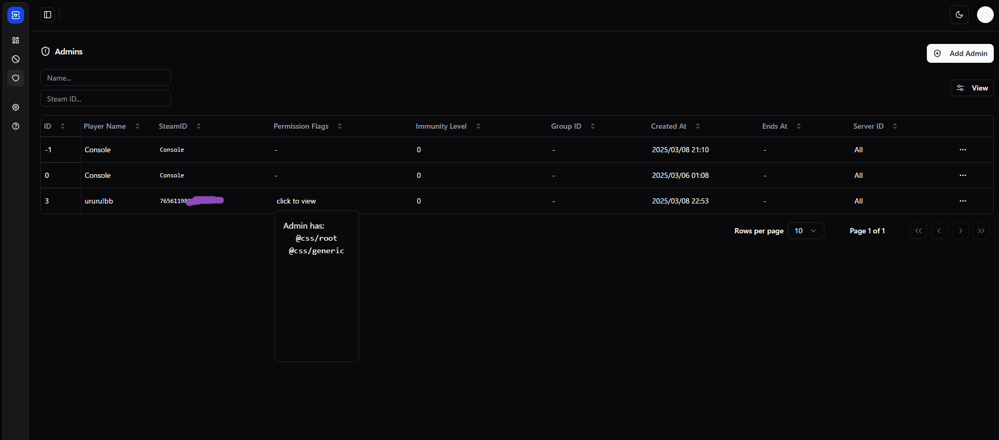
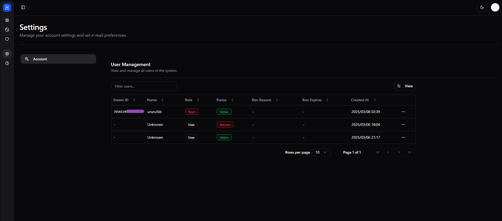

# [Bans Sharp](https://github.com/possession-community/BansSharp)

SourceBans-like dashboard for CSSharp created with 🏝️ TanStack Start.

Made by [uru](https://github.com/2vg)

## Table of Contents

- [Features](#features)
- [Tech stack](#tech-stack)
- [Requirements](#requirements)
- [Screenshots](#screenshots)
- [Build](#build)
- [Issue watchlist](#issue-watchlist)
- [Auth](#auth)
- [Goodies](#goodies)
  - [Scripts](#scripts)
- [Building for production](#building-for-production)
- [Acknowledgements](#acknowledgements)


## Features

- **Server List:** View connected game servers.
- **Violation Information:** Display ban and communication restriction details.
- **Player Violation Management:** Add, edit, and remove player bans and communication restrictions.
- **Admin Management:** Manage administrator users and their permissions.
- **Steam Authentication:** Log in securely using your Steam account.
- **Role-Based Access Control:** Different user roles (User, Admin, Root) with varying levels of access.


## Tech stack

- [React 19](https://react.dev) + [React Compiler](https://react.dev/learn/react-compiler)
- TanStack [Start](https://tanstack.com/start/latest) + [Router](https://tanstack.com/router/latest) + [Query](https://tanstack.com/query/latest)
- [Tailwind CSS v4](https://tailwindcss.com/) + [shadcn/ui](https://ui.shadcn.com/)
- [Drizzle ORM](https://orm.drizzle.team/) + MySQL
- [Better Auth](https://www.better-auth.com/)

## Requirements

- Node.js (tested v23.3.0) + pnpm(npm, yarn)
- BETTER_AUTH_SECRET: [Installation - Set Environment Variables](https://www.better-auth.com/docs/installation#set-environment-variables)
- MySQL (tested 8.0)
- Supported cssharp plugins
  - [daffyyyy/CS2-SimpleAdmin](https://github.com/daffyyyy/CS2-SimpleAdmin)
  - Add a few more in the future... (plan to add vip and entwatch, for now)

## Screenshots


_Dashboard Overview_


_Ban List_


_Communication Restrictions_


_Admin Management_


_User Settings_


## Build

1. clone this repository.

2. Install dependencies:

   ```bash
   pnpm i
   ```

3. Create a `.env` file based on [`.env.example`](./.env.example).

4. Push the schema to your database with drizzle-kit:

⚠️ Be careful not to delete any other tables, as choosing Yes in the Drizzle dialog will delete the tables and their data.

   ```bash
   pnpm db push
   ```

   https://orm.drizzle.team/docs/migrations

5. Run the development server:

   ```bash
   pnpm dev
   ```

   The development server should be now running at [http://localhost:3000](http://localhost:3000).

## Issue watchlist

- [React Compiler docs](https://react.dev/learn/react-compiler), [Working Group](https://github.com/reactwg/react-compiler/discussions) - React Compiler is still in beta. You can disable it in [app.config.ts](./app.config.ts#L15) if you prefer.
- https://github.com/TanStack/router/discussions/2863 - TanStack Start is currently in beta and may still undergo major changes.
- https://github.com/shadcn-ui/ui/discussions/6714 - We're using the `canary` version of shadcn/ui for Tailwind v4 support.

## Auth

Better Auth is currently configured for email/password authentication, but can be easily modified to use other providers.

Here is how to create root account.

1. Sign-In with Steam authentication
2. In server console, type `pnpm change-role <your_STEAM_ID> root`
3. Reload the browser, done. You can manage any users in Settings page.

## Goodies

#### Scripts

These scripts in [package.json](./package.json#L5) use **pnpm** by default, but you can modify them to use your preferred package manager.

- **`auth:generate`** - Regenerate the [auth db schema](./lib/server/schema/auth.schema.ts) if you've made changes to your Better Auth [config](./lib/server/auth.ts).
- **`db`** - Run drizzle-kit commands. (e.g. `pnpm db generate` to generate a migration)
- **`ui`** - The shadcn/ui CLI. (e.g. `pnpm ui add button` to add the button component)
- **`format`** and **`lint`** - Run Prettier and ESLint.

## Building for production

Read the [hosting docs](https://tanstack.com/start/latest/docs/framework/react/hosting) for information on how to deploy your TanStack Start app.

## Acknowledgements

- [react-tanstarter](https://github.com/dotnize/react-tanstarter) - Without his starter this project could not have been developed, I am very grateful to him! And please check out this great starter!
- [shadcn-admin](https://github.com/satnaing/shadcn-admin) - The layout and file structure, etc. of the dashboard was inspired by his project. His admin dashboard is a very nice project!
